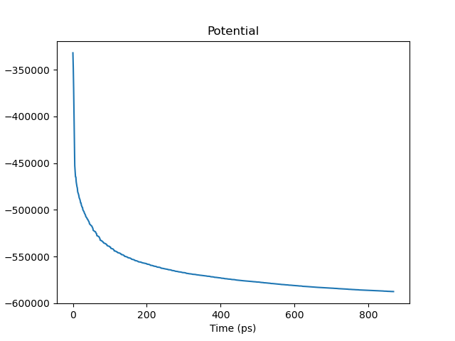
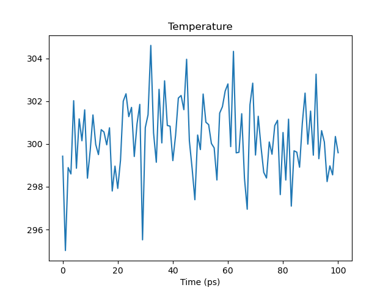
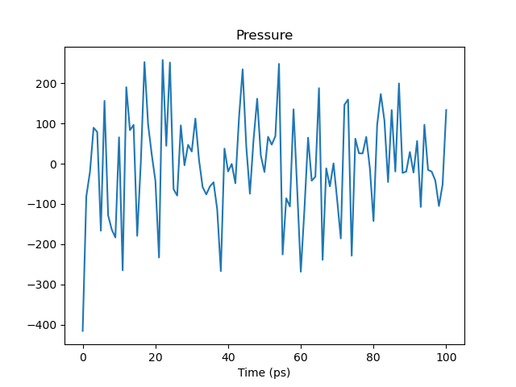
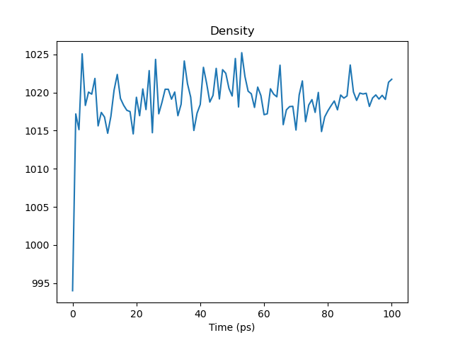
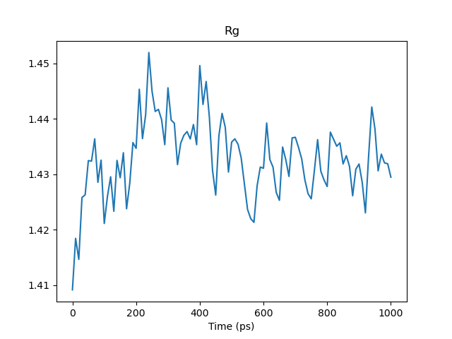
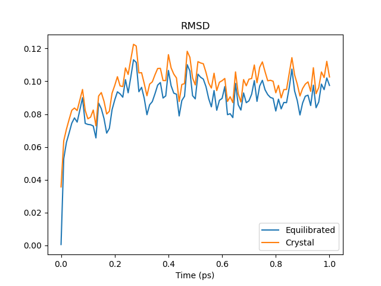

# Gromacs Lysozyme Tutorial [Generated Files from]
### Andrew Garcia

Tutorial link:
http://www.mdtutorials.com/gmx/lysozyme/index.html

step-by-step
```shell
#Open Ubuntu emulator OR terminal if Ubuntu = OS
cd $HOME/scripts/GROMACS-1aki

grep -v HOH 1aki.pdb > 1AKI_clean.pdb

gmx pdb2gmx -f 1AKI_clean.pdb -o 1AKI_processed.gro -water spce

gmx editconf -f 1AKI_processed.gro -o 1AKI_newbox.gro -c -d 1.0 -bt cubic

gmx solvate -cp 1AKI_newbox.gro -cs spc216.gro -o 1AKI_solv.gro -p topol.top

gmx grompp -f ions.mdp -c 1AKI_solv.gro -p topol.top -o ions.tpr

gmx genion -s ions.tpr -o 1AKI_solv_ions.gro -p topol.top -pname NA -nname CL -neutral

#**Energy Minimization**
#Downloaded minim.mdp
gmx grompp -f minim.mdp -c 1AKI_solv_ions.gro -p topol.top -o em.tpr
gmx mdrun -v -deffnm em

#**NVT equilibration**
#Downloaded nvt.mdp
gmx grompp -f nvt.mdp -c em.gro -r em.gro -p topol.top -o nvt.tpr
gmx mdrun -deffnm nvt

gmx energy -f nvt.edr -o temperature.xvg

#**NPT equilibration**
gmx grompp -f npt.mdp -c nvt.gro -r nvt.gro -t nvt.cpt -p topol.top -o npt.tpr
gmx mdrun -deffnm npt

gmx energy -f npt.edr -o pressure.xvg

gmx energy -f npt.edr -o density.xvg

#**Production**
#Downloaded md.mdp
gmx grompp -f md.mdp -c npt.gro -t npt.cpt -p topol.top -o md_0_1.tpr

gmx mdrun -deffnm md_0_1
```








